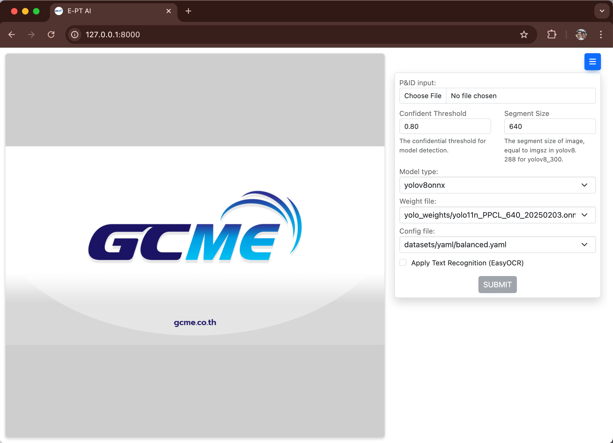

# 🛠️ GARNET: AI-Driven P&ID Symbol Detection and Analysis

**G**CME **A**I-**R**ecognition **N**etwork for **E**ngineering **T**echnology  
_Precision in Every Connection_

[](https://github.com/ultralytics/ultralytics)
[](https://opencv.org/)
[](https://networkx.org/)
[](https://github.com/JaidedAI/EasyOCR)

GARNET is an AI-powered tool designed to **automate symbol detection, classification, and connectivity analysis** in Piping and Instrumentation Diagrams (P&IDs). Built for engineers and maintenance teams, it combines state-of-the-art object detection (YOLOv8) with graph-based analytics to transform P&ID workflows.

---

## 🚀 Features

-   **Symbol Detection**: Identify valves (gate, globe, check), pumps, tanks, and more using YOLOv8.
-   **Automated Counting**: Generate counts for each symbol type in a P&ID.
-   **Graph-Based Analysis**: Model P&IDs as networks to analyze connectivity, critical paths, and system dependencies.
-   **Export Results**: Export detection results and connectivity graphs to CSV, PDF, or JSON.
-   **User-Friendly Interface**: Simple CLI and scriptable API for integration into existing workflows.

---

## 📦 Installation

1. **Clone the Repository**:

    ```bash
    git clone https://github.com/your-username/GARNET.git
    cd GARNET
    ```

2. **Install Dependencies**:
    ```bash
    pip install -r requirements.txt
    ```

---

## 🖥️ Usage

### 1. **Web Application (Interactive Inference)**

Run the web interface to upload P&IDs, select models, and view results in real time:

1. **Start the Web Server**:

    ```bash
    uvicorn main:app --reload
    ```

    Access the app at `http://localhost:8000`.

2. **Using the Web Interface**:
    - **Upload a P&ID**: Select an image file (JPG/PNG).
    - **Model Configuration**: Choose a model type (e.g., YOLOv5, YOLOv8) and upload custom weights (`.pt` file).
    - **Run Inference**: Click "Submit" to detect symbols and display results.
    - **Results**: View annotated images, symbol counts, and download reports (CSV/JSON).



---

### 2. **Batch Inference Script**

Run inference on multiple P&IDs in a folder using `predict_images.py`:

1. **Command-Line Arguments**:

    ```bash
    python predict_images.py \
        --image_path path/to/pids_folder \
        --model_type yolov8 \
        --model_path path/to/model_weights.pt \
        --output_path results/
    ```

2. **Output**:
    - Annotated images (saved in output_path).
    - CSV file with symbol counts (`output_path/symbol_counts.csv`).

Example code snippet:

```python
from garnet.inference import predict_images

predict_images(
    image_path="path/to/pids_folder",
    model_type="yolov8",
    model_path="path/to/model_weights.pt",
    output_path="results/"
)
```

---

### 3. **Pipeline: End-to-End P&ID Digitization and Connectivity Analysis**

Based on our reference methodology, the following pipeline will be implemented:

1. **Preprocessing**
   - Load and normalize the P&ID image.
   - Optional: Denoising, binarization, and removal of scanning artifacts.
  
2. **Object Detection**
   - Detect P&ID symbols using YOLOv11/YOLOv8.
   - Classes include valves, pumps, tanks, instruments, and custom symbols.
   - Export detections as bounding boxes (YOLO or COCO format).

3. **Text Recognition**
   - Use EasyOCR or PaddleOCR for text extraction (supports horizontal and vertical text).
   - Merge OCR results from multiple rotations.
   - Output text annotations (JSON).

4. **Line Extraction**
   - Remove detected symbols and text areas from the image to isolate pipelines.
   - Apply morphological operations to extract lines (handles 90° turns and intersections).
   - Merge fragmented line segments.

5. **Line-Symbol Connection**
   - Detect intersection points between line segments and symbol bounding boxes.
   - Assign connectivity relationships between symbols and lines.

6. **Graph Construction**
   - Convert connected symbols and pipelines into a NetworkX graph.
   - Nodes = symbols (with attributes like tag, type).
   - Edges = pipelines (with attributes like length, type).

7. **Graph Analysis**
   - Perform connectivity analysis: critical paths, loops, flow direction inference.
   - Detect isolated components or redundant loops.

8. **DEXPI Export**
   - Convert the annotated P&ID into DEXPI-compliant XML.
   - Include geometry, symbol metadata, and connectivity.

9. **Visualization and Reporting**
   - Overlay detected objects, text, and pipelines on the original P&ID.
   - Export results as PNG/PDF/JSON.
   - Provide interactive graph visualization (future feature).


**Note:** This pipeline is designed to be modular, so each step can be run independently or as part of the full digitization workflow.

*Reference:* Adapted from "End-to-End Digitization of Image Format Piping and Instrumentation Diagrams" (2024).

Note: A staged, runnable pipeline with CLI is available in `garnet/pid_extractor.py`. See `garnet/README_pid_pipeline.md` for usage, stages, tuning knobs, and output artifacts.

---

### 4. **Model Training (Optional)**

To train custom YOLO models for P&ID symbols:

```bash
yolo train \
    data=data.yaml \
    model=yolov8n.pt \
    epochs=100 \
    imgsz=640 \
    batch=16
```

## 📂 Dataset

GARNET uses the YOLOv8 dataset format. Example structure:

```
dataset/
├── train/
│   ├── images/  # P&ID images (.jpg, .png)
│   └── labels/  # YOLO-format labels (.txt)
├── val/
│   ├── images/
│   └── labels/
└── data.yaml     # Dataset config (class names, paths)
```

Example `data.yaml`:

```yaml
train: dataset/train/images
val: dataset/val/images

nc: 6 # Number of classes
names: ["valve", "gate_valve", "globe_valve", "check_valve", "pump", "tank"]
```

---

## 📊 Results

| **Detection**                                     | **Graph Analysis**                               |
| ------------------------------------------------- | ------------------------------------------------ |
|  |  |

_Example output: Symbol counts and connectivity graph for a P&ID._

---

## 📈 Future Outcomes

Additional planned outcomes from the GARNET project include:

-   **MTO for Valves**: Automated generation of material take-off lists for all detected valve types, including specifications and quantities.
-   **Line List**: Extraction and tabulation of pipeline data, including line tags, sizes, service, and connected equipment.

---

## 🤝 Contributing

Contributions are welcome! Please fork the repository and submit a pull request.  
For major changes, open an issue first to discuss your ideas.

---

## 📜 License

This project is licensed under the **MIT License**. See [LICENSE](LICENSE) for details.

---

## 📧 Contact

For questions or collaborations, contact:

-   **Your Name** - [may3rd@gmail.com](mailto:may3rd@gmail.com)
-   **GCME (GC Maintenance and Engineering Co., Ltd.)** - [www.gcme.com](https://www.gcme.com)
